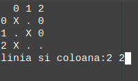

# X si 0

Clasicul joc de X si 0 
## Cum se joaca
* Dimensiunea tablei de joc nu este fixa
* La inceputul fiecarui joc se precizeaza dimensiunea
* Fiecare jucator alege coordonatele punctului in care vrea sa puna X respectiv 0
* Cel care completeaza o linie(verticala/orizontala) sau o diagonala, castiga.  

